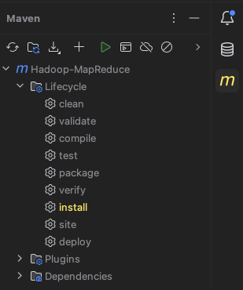
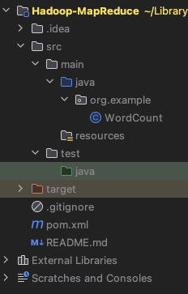
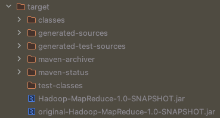
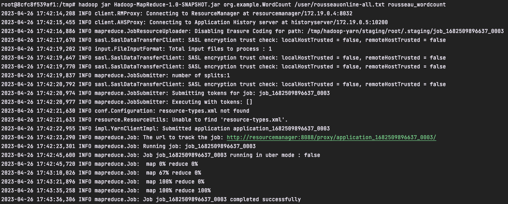
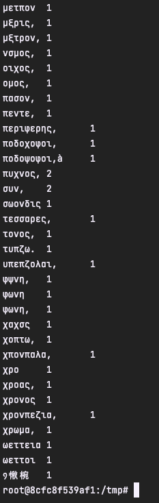
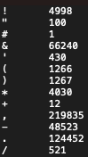

# Hadoop Map Reduce


### Auteur : RIBES Maël

## Sommaire

1.  [Installation d'Hadoop](#installation-dhadoop)
2.  [Création du projet Maven](#création-du-projet-maven)
3.  [Implémentation du Map Reduce](#implémentation-du-map-reduce-)
4.  [Récupération des résultats](#récupération-des-résultats)
5.  [Amélioration du Word Count](#amélioration-du-word-count)

## Installation d'Hadoop

---

Nous allons dans un premier temps voir comment installer Hadoop avec Docker. La première étape consiste à clonner le répertoire [GitHub](https://github.com/big-data-europe/docker-hadoop).

```shell
git clone https://github.com/big-data-europe/docker-hadoop
```

Une fois ceci fait, il faut lancer la commande permettant de construire l'image Docker à partir du répertoire clonné précédement:

```shell
docker-compose up -d
```

/!\ Pour lancer la commande, il faut se trouver dans le répertoire **docker-hadoop**.

## Création du projet Maven

Maintenant que Hadoop est installé et lancé sur Docker, il faut maintenant créer le code Java du Map Reduce. Commençons par créer un projet Maven grâce à IntelliJ.

Il faut d'abord ajouter les dépendances nécessaires à la génération du projet. Dans le fichier **pom.xml**, ajoutez les lignes suivantes :

```xml
<dependencies>
        <dependency>
            <groupId>org.apache.hadoop</groupId>
            <artifactId>hadoop-mapreduce-examples</artifactId>
            <version>3.3.5</version>
            <scope>provided</scope>
        </dependency>
        <dependency>
            <groupId>org.apache.hadoop</groupId>
            <artifactId>hadoop-mapreduce-client-common</artifactId>
            <version>3.3.5</version>
            <scope>provided</scope>
        </dependency>
        <dependency>
            <groupId>org.apache.hadoop</groupId>
            <artifactId>hadoop-common</artifactId>
            <version>3.3.5</version>
            <scope>provided</scope>
        </dependency>
    </dependencies>
```

Ajoutez ensuite ces lignes permettant de configurer la génération du projet en ajoutant des plug-ins :

```xml
<build>
        <plugins>
            <plugin>
                <groupId>org.apache.maven.plugins</groupId>
                <artifactId>maven-shade-plugin</artifactId>
                <version>3.4.1</version>
                <configuration>
                    <transformers>
                        <transformer implementation="org.apache.maven.plugins.shade.resource.ApacheLicenseResourceTransformer">
                        </transformer>
                    </transformers>
                </configuration>
                <executions>
                    <execution>
                        <phase>package</phase>
                        <goals>
                            <goal>shade</goal>
                        </goals>
                    </execution>
                </executions>
            </plugin>
            <plugin>
                <groupId>org.apache.maven.plugins</groupId>
                <artifactId>maven-compiler-plugin</artifactId>
                <version>3.11.0</version>
                <configuration>
                    <source>1.8</source>
                    <target>1.8</target>
                </configuration>
            </plugin>
        </plugins>
    </build>
```

Une fois ceci fait, nous pouvons lancer la construction du projet. Dans IntelliJ, cliquer sur le logo Maven à droite puis cliquer sur _install_.

<p align="center">

</p>

## Implémentation du Map Reduce

Dans ce bref tutoriel, nous n'implémenterons que la première partie du Map Reduce, à savoir le **Word Count**. Dans le package _org.exemple_ créez donc une classe **WordCount**. Votre projet devrait ressembler à cela :

<p align="center">

</p>

Copiez-collez ensuite dans votre classe **WordCount** le code java suivant :

```java
package org.example;

import java.io.IOException;
import java.util.StringTokenizer;
import org.apache.hadoop.conf.Configuration;
import org.apache.hadoop.fs.Path;
import org.apache.hadoop.io.IntWritable;
import org.apache.hadoop.io.Text;
import org.apache.hadoop.mapreduce.Job;
import org.apache.hadoop.mapreduce.Mapper;
import org.apache.hadoop.mapreduce.Reducer;
import org.apache.hadoop.mapreduce.lib.input.FileInputFormat;
import org.apache.hadoop.mapreduce.lib.output.FileOutputFormat;
import org.apache.hadoop.util.GenericOptionsParser;

public class WordCount {

    public static class TokenizerMapper
            extends Mapper<Object, Text, Text, IntWritable>{

        private final static IntWritable one = new IntWritable(1);
        private Text word = new Text();

        public void map(Object key, Text value, Context context
        ) throws IOException, InterruptedException {
            StringTokenizer itr = new StringTokenizer(value.toString());
            while (itr.hasMoreTokens()) {
                word.set(itr.nextToken());
                context.write(word, one);
            }
        }
    }

    public static class IntSumReducer
            extends Reducer<Text,IntWritable,Text,IntWritable> {
        private IntWritable result = new IntWritable();

        public void reduce(Text key, Iterable<IntWritable> values,
                           Context context
        ) throws IOException, InterruptedException {
            int sum = 0;
            for (IntWritable val : values) {
                sum += val.get();
            }
            result.set(sum);
            context.write(key, result);
        }
    }

    public static void main(String[] args) throws Exception {
        Configuration conf = new Configuration();
        String[] otherArgs = new GenericOptionsParser(conf, args).getRemainingArgs();
        if (otherArgs.length != 2) {
            System.err.println("Usage: wordcount <in> <out>");
            System.exit(2);
        }
        Job job = new Job(conf, "word count");
        job.setJarByClass(WordCount.class);
        job.setMapperClass(TokenizerMapper.class);
        job.setCombinerClass(IntSumReducer.class);
        job.setReducerClass(IntSumReducer.class);
        job.setOutputKeyClass(Text.class);
        job.setOutputValueClass(IntWritable.class);
        FileInputFormat.addInputPath(job, new Path(otherArgs[0]));
        FileOutputFormat.setOutputPath(job, new Path(otherArgs[1]));
        System.exit(job.waitForCompletion(true) ? 0 : 1);
    }
}
```

Cette implémentation du Word Count reste très basique, mais nous verrons par la suite qu'il est possible de l'améliorer un peu.

Relancez ensuite la commande _install_ de Maven. Vous devriez maintenant avoir un fichier _[votre nom de projet]-1.0-SNAPSHOT.jar_ dans votre dossier target. C'est ce fichier que nous allons lancer avec Hadoop.

<p align="center">

</p>

## Lancement du Map Reduce avec Hadoop

Tout d'abord, vérifiez que Hadoop est bien lancé sur Docker. Nous allons ensuite devoir copier le fichier jar de notre projet et le fichier d'input dans un répertoire de notre container Hadoop **namenode**, par exemple le répertoire _/tmp_. Dans notre exemple, nous utiliserons en input un fichier texte des oeuvres de Rousseau mais n'importe quel autre fichier texte peut faire l'affaire.

Ouvrez un terminal à la racine de votre projet Maven et lancez la commande suivante en remplaçant par le nom de vos fichiers pour ajouter le .jar et l'input :

```shell
docker cp <file_path> namenode:/tmp
```

Vous pouvez maintenant entrer dans le **namenode** et aller au repertoire _/tmp_ en utilisant les commandes suivantes dans un terminal :

```shell
docker exec -it namenode /bin/bash
cd tmp
```

Vos fichiers sont donc stockés sur votre nœud local dans le répertoire _/tmp_. Vérifiez que c'est bien le cas avec la commande `ls`. Cependant, afin de pouvoir lancer notre Map Reduce avec Hadoop, notre fichier input doit se trouver sur le système de fichier distribué de Hadoop (HDFS). Pour l'ajouter, executez les commandes suivantes :

```shell
hdfs dfs -mkdir -p /user/root
hdfs dfs -put rousseauonline-all.txt /user
```

Tout est enfin prêt pour lancer notre Map Reduce ! Exécutez la commande :

```shell
# hadoop jar <jar_file_name> <class_name> input output
hadoop jar Hadoop-MapReduce-1.0-SNAPSHOT.jar org.example.WordCount /user/rousseauonline-all.txt rousseau_wordcount
```

Vous devriez normalement obtenir ceci suite à l'exécution de cette ligne.

<p align="center">

</p>

## Récupération des résultats

Vous pouvez, si vous le souhaitez, afficher dans la console le résultat de votre Map Reduce en entrant la commande suivante :

```shell
hdfs dfs -cat /user/root/rousseau_wordcount.txt/part-r-00000
```

Vous devriez obtenir cet affichage de la fin du fichier de résultat :

<p align="center">

</p>

Pour récupérer le fichier de résultats, exécutez cette ligne :

```shell
hdfs dfs -copyToLocal /user/root/rousseau_wordcount/part-r-00000
```

Votre fichier de résultats se trouve maintenant dans le répertoire _/tmp_ du stockage local de votre container **namenode**. Libre à vous de le déplacer où vous le souhaitez :

```shell
docker cp namenode:/tmp/part-r-00000 <path>
```

## Amélioration du Word Count

Nous remarquons que notre Word Count n'est pas très efficace. En effet, la ponctuation n'est pas prise en compte correctement. Nous préférerions que la ponctuation soit traitée comme des mots à part. Modifions donc la méthode _map_ la classe **WordCount**.

Copiez et remplacez la méthode _map_ par celle-ci :

```java
public void map(Object key, Text value, Context context
        ) throws IOException, InterruptedException {
            String temp = value.toString().replaceAll("([^\w\sÀ-ÖØ-öø-ÿ])", " $1 ");
            StringTokenizer itr = new StringTokenizer(temp);
            while (itr.hasMoreTokens()) {
                word.set(itr.nextToken());
                context.write(word, one);
            }
        }
```

Cette modification permet d'exclure toute la ponctuation des mots tout en gardant les lettres accentuées dans les mots. Voici ce que nous obtenons finalement pour la ponctuation :

<p align="center">

</p>
